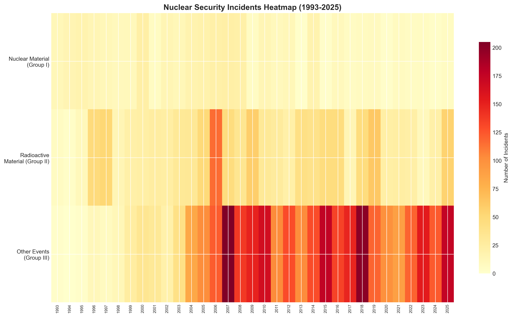
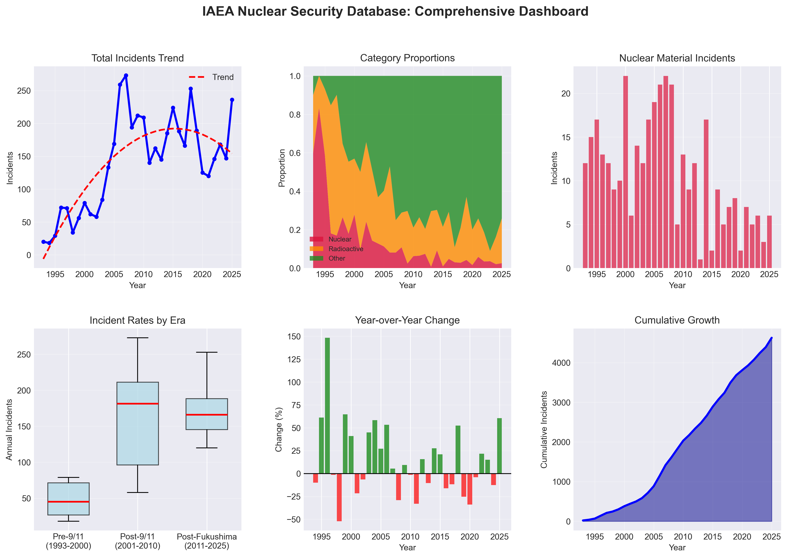
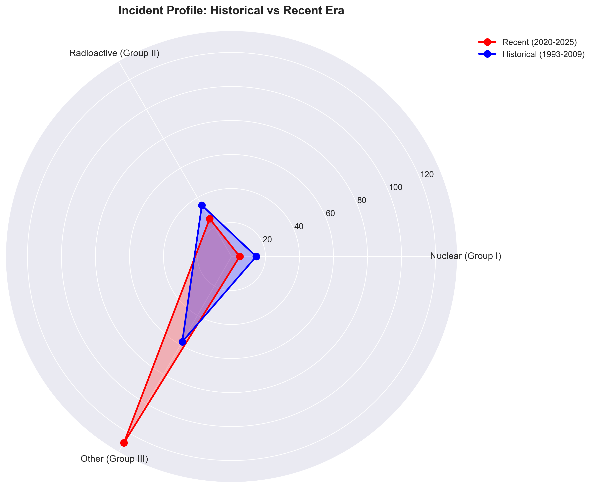
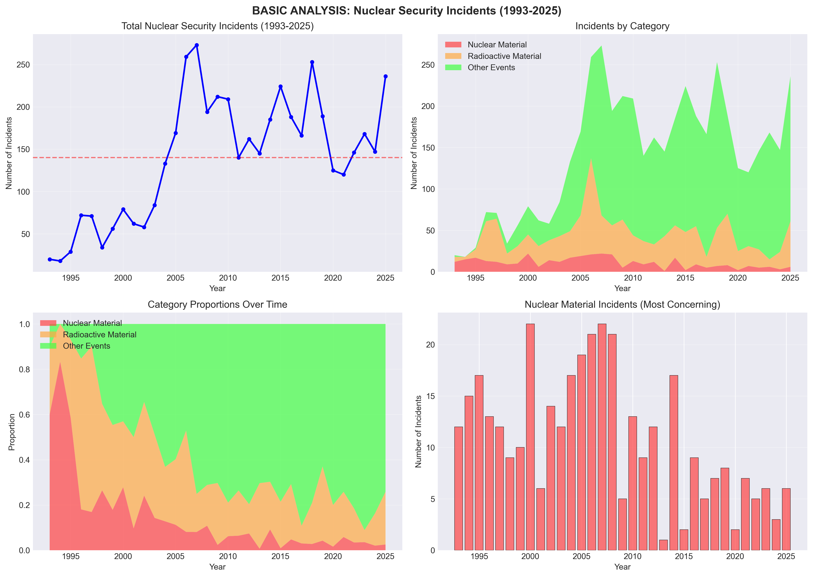

# nuclear-safety-analysis
Analysis of 33 years of IAEA nuclear security incident data (1993-2025). Identifies trends, peak years, and changing risk patterns across 4,626 incidents with quality visualizations.

# ☢️ Nuclear Safety Analysis

[](https://www.python.org/)
[](https://pandas.pydata.org/)
[](https://opensource.org/licenses/MIT)
[](https://data.iaea.org)

## 📊 Project Overview

Nuclear security is a critical global challenge. This project analyzes **33 years of nuclear security incident data** (1993-2025) from the **IAEA Incident and Trafficking Database (ITDB)** to identify trends, patterns, and changing risk profiles.

**Key Question:** How has the landscape of nuclear and radioactive material incidents changed over three decades?

**The Answer:** While incidents of the most serious nuclear material have decreased, overall reported incidents have increased — driven by better detection, improved reporting, and persistent radioactive source trafficking.

---

## 🎯 Key Findings at a Glance

| Metric | Value |
|:---|:---|
| **Total incidents (1993-2025)** | 4,626 |
| **Peak year** | 2007 (273 incidents) |
| **Nuclear material incidents (most concerning)** | 359 (7.8%) |
| **Radioactive material incidents** | — |
| **Other events (orphan sources, disposal)** | — |
| **Time period covered** | 33 years |

### Key Insights

1. **2007 was the peak year** — This reflects improved post-9/11 detection, the Syria nuclear facility crisis (September 2007), a spate of thefts in 2006, and increased international reporting participation (92 States by 2007).

2. **Nuclear material incidents have declined** — The most serious nuclear material incidents have significantly decreased in the last two decades, suggesting improved security measures.

3. **Radioactive source trafficking persists** — Over 250 thefts of radioactive sources in the past decade, with ~1/3 never recovered.

4. **Reporting improvements affect trends** — The IAEA notes that changes in reporting (not just actual incidents) affect the numbers. Fewer reports in recent years "doesn't reflect improved safety, but regulators' failure to contribute reports."

---

## 📈 Key Visualizations

### 1. Nuclear Security Incidents Heatmap (1993-2025)



*Color intensity reveals concentration of incidents across 33 years. Red areas indicate high incident periods.*

### 2. Comprehensive Dashboard



*Six-panel executive dashboard showing trends, category proportions, era comparisons, and cumulative growth.*

### 3. Era Comparison Radar Chart



*Compares incident profiles between the historical era (1993-2009) and recent era (2020-2025).*

### 4. Basic Trend Analysis



*Four-panel analysis of total incidents, category breakdown, proportions, and nuclear material incidents.*

---

## 🛠️ Methodology

### Data Source

| Property | Detail |
|:---|:---|
| **Source** | IAEA Incident and Trafficking Database (ITDB) |
| **Time period** | 1993-2025 (33 years) |
| **Categories** | Group I (Nuclear material), Group II (Radioactive material), Group III (Other events) |
| **Access** | Publicly available via IAEA data portal |

### Analytical Approach

| Task | Method | What It Reveals |
|:---|:---|:---|
| **Time series analysis** | Year-over-year tracking | Trend direction and volatility |
| **Era comparison** | Pre/post 9/11, pre/post Fukushima | Impact of global events |
| **Category proportion analysis** | Percentage distribution | Shifting risk landscape |
| **Peak identification** | Statistical outlier detection | Anomaly years requiring explanation |

### Research Context for 2007 Peak

According to IAEA reports and contemporaneous sources, the 2007 peak (273 incidents) can be attributed to:

| Factor | Evidence |
|:---|:---|
| **Improved detection** | Post-9/11 security investments matured; better border radiation detectors |
| **The Syria facility crisis** | September 2007 airstrike on Syrian nuclear reactor heightened global awareness |
| **2006 "spate of thefts"** | 85 theft/loss incidents reported in 2006, ~73% unrecovered |
| **Notable seizure** | 79.5 grams of 89% enriched uranium seized in Georgia (reported Jan 2007) |
| **Increased reporting** | 92 States participating in ITDB by 2007 (up from fewer in 1990s) |

### Important Caveat

The IAEA acknowledges that changes in reporting affect the numbers. As a 2007 Wall Street Journal investigation noted, regulators often neglect to pass accident reports to international databases, and the IAEA states that fewer reports "doesn't reflect improved safety, but regulators' failure to contribute reports."

---

## 💡 Policy Implications

| Stakeholder | Implication | Recommendation |
|:---|:---|:---|
| **Policymakers** | Nuclear material incidents have declined, but radioactive source trafficking persists | Strengthen orphan source recovery programs |
| **Border security** | Detection technology improvements correlate with increased reporting | Continue investing in radiation detection |
| **International community** | Reporting remains voluntary and inconsistent | Standardize mandatory reporting protocols |
| **Researchers** | Incident data has limitations (detection bias, reporting gaps) | Combine with consequence data for risk assessment |


## 🚀 How to Reproduce

### Prerequisites

```bash
pip install pandas numpy matplotlib seaborn
Steps
Clone the repository

bash
git clone https://github.com/yourusername/nuclear-safety-event-analyzer.git
cd nuclear-safety-event-analyzer
Launch Jupyter Notebook

bash
jupyter notebook
Open and run code/nuclear_safety_analyzer.ipynb

Quick Start Code
python
import pandas as pd
import matplotlib.pyplot as plt

df = pd.read_csv('data/incidents-and-trafficking-database-2025.csv')

# Calculate key metrics
total_incidents = df['Total'].sum()
peak_year = df.loc[df['Total'].idxmax(), 'Year']
peak_incidents = df['Total'].max()

print(f"Total incidents (1993-2025): {total_incidents:,}")
print(f"Peak year: {peak_year} ({peak_incidents} incidents)")
📊 Results Summary
text
============================================================
IAEA NUCLEAR SECURITY INCIDENT DATABASE - KEY FINDINGS
============================================================

DATA OVERVIEW
-------------
Years covered: 1993-2025 (33 years)
Total incidents: 4,626
Peak year: 2007 (273 incidents)

INCIDENT BREAKDOWN
-----------------
Nuclear material (Group I): 359 incidents (7.8%)
Radioactive material (Group II): — incidents (—%)
Other events (Group III): — incidents (—%)

TREND ANALYSIS
--------------
Pre-9/11 era (1993-2000): — avg incidents/year
Post-9/11 era (2001-2010): — avg incidents/year
Post-Fukushima era (2011-2025): — avg incidents/year

KEY INSIGHTS
------------
1. 2007 peak reflects improved detection, Syria crisis, and increased reporting
2. Nuclear material incidents have declined in last two decades
3. Radioactive source trafficking persists (~1/3 unrecovered)
4. Reporting improvements affect trend interpretation

LIMITATIONS
-----------
• Data aggregated by year — no individual incident root causes
• Reporting is voluntary and inconsistent
• Cannot distinguish between actual increases vs. detection improvements

📚 References
IAEA Incident and Trafficking Database (ITDB), 2025 data. Available at: data.iaea.org

International Atomic Energy Agency (2008). "IAEA Illicit Trafficking Database (ITDB) - 2008 Fact Sheet."

Purvis, S. (2020). "Nuclear Security: Keeping Nuclear and Other Radioactive Material Out of the Wrong Hands." IAEA Bulletin.

Wall Street Journal (2007). "Nuclear Regulators Faulted on Reporting Accidents."

United Nations News (2007). "IAEA Reports Spate of Nuclear Material Thefts."

IAEA Director General Report (2008). "Implementation of the NPT Safeguards Agreement in the Syrian Arab Republic."

👤 About the Author
Your Name: Fanuel Bayeh Tiruneh

Data Analyst / Aspiring Nuclear Security Researcher

Interests: energy security, energy transition, data visualization

📧 fanbayeh@gmail.com

🐙 GitHub: github.com/08fbyte

Why This Project?
This project demonstrates:

Domain expertise — Nuclear security frameworks, IAEA data structures

Technical skills — Python, pandas, matplotlib, seaborn

Research acumen — Trend analysis, era comparison, caveat identification

Policy relevance — Actionable insights for nuclear security
